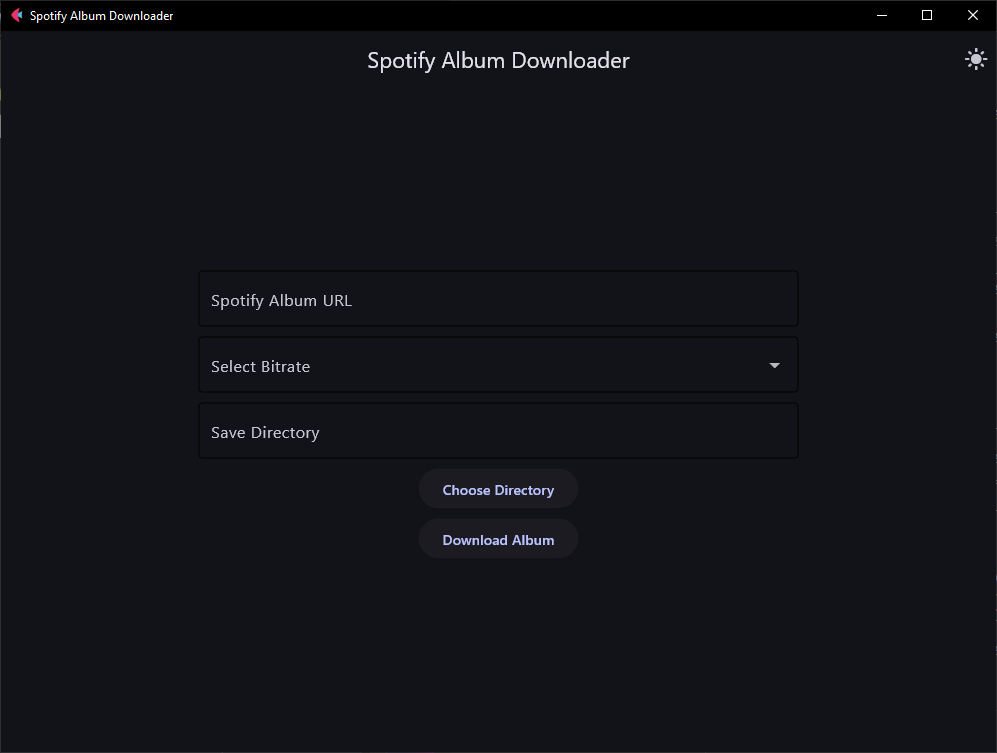
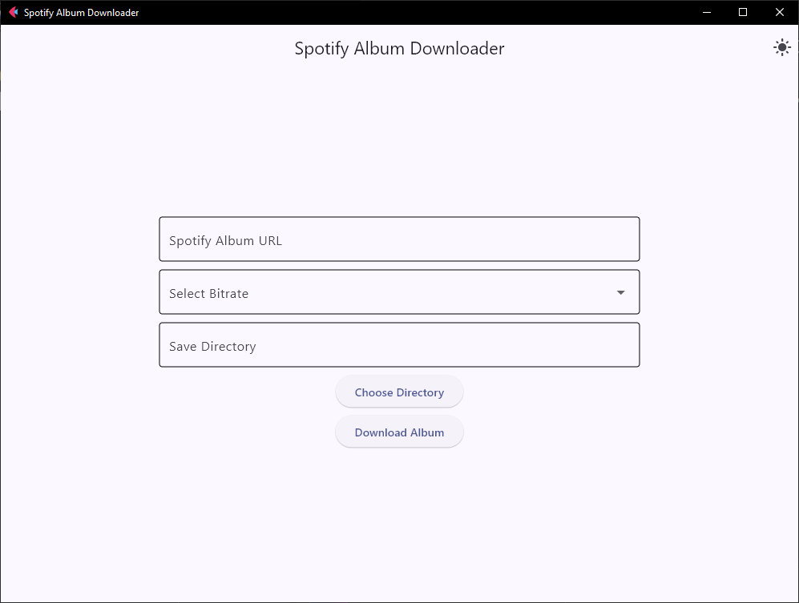

# Spotify Album Downloader

A Python application with a graphical user interface (GUI) built using Flet, which allows users to download Spotify albums. Users can specify the album URL, choose the bitrate for the songs, and select a directory to save the downloaded files. The app supports both light and dark themes with a toggle feature.

<div>
  
  
</div>

## Features

- Spotify Album Download: Download entire albums from Spotify.
- Bitrate Selection: Choose from multiple bitrate options (128 kbps, 192 kbps, 256 kbps, 320 kbps).
- Directory Selection: Choose a directory to save the downloaded files.
- Theme Toggle: Switch between light and dark mode for the UI.
- Automatic Installation: Checks and installs spotdl if not already installed.

## Installation

- Clone the repository:

```bash
git clone https://github.com/k1lgor/spotify-downloader-gui.git
cd spotify-downloader-gui
```

- Install required Python packages:

```bash
poetry install
```

- Run the application:

```bash
flet run main.py
```

## Usage

- Open the application.
- Enter the Spotify album URL in the provided text field.
- Select the desired bitrate from the dropdown menu.
- Choose the directory where the songs will be saved.
- Click "Download Album" to start the download.
- Use the "Switch to Dark Mode" button to toggle between light and dark themes.


